# El7a2ni Pharmacy Edgerunners

El7a2ni Pharmacy is a virtual pharmacy where pharmacists, patients and administrators benefit from it where:

- Patients can search for available medicines and add to their cart based on various criteria.
- Patients can view their cart and have various options for checkout.
- Patients can view their current and past orders' details.
- Patients can chat with pharmacists for consultation, and pharmacists can chat with doctors.
- Pharmacists can add and edit medicines.
- Pharmacists receive a notification through the system and email once a medicine is out of stock.
- Pharmacists and administrators can view a total sales report for medicine.
- Admins can view all users' basic information.

## Motivation

Our team took up the challenge to reimagine healthcare solutions, bridging the gap between patients and pharmacists. The motivation behind El7a2ny was to create a virtual pharmacy ecosystem that not only simplifies medical processes but also enriches the overall patient experience.

## Goal

Our goal is straightforward: to break down the complexities of traditional healthcare systems and offer a solution that anyone can use effortlessly. We believe in making a positive impact on the lives of individuals by providing a streamlined and intuitive healthcare experience.

## Build Status

 - No feedback provided if there are missing fields when registering, and if no more medicine amount can be added for patient.


## Code Style

- **Indentation:** Our code is indented as it properly should be.
- **Naming Conventions:** Variables and functions follow PascalCase naming convention.
- **Braces:** K&R style is used for brace placement.
- **Comments:** Use meaningful comments sparingly to explain complex logic or important details.

## installion

- clone:

```bash
  git clone https://github.com/advanced-computer-lab-2023/Edgerunners-Pharmacy.git
```

To setup everything

- backend:

```bash
  cd backend
  npm install
```

- frontend:

```bash
  cd frontend
  npm install
```

- sample env file:

```bash
  MONGO_URI = 'mongo database'
  PORT = 3001
  JWT_SECRETA = 'Admin secret'
  JWT_SECRETPH = 'Pharmacist secret'
  JWT_SECRETP = 'Patient secret'
```

## Screenshots of website

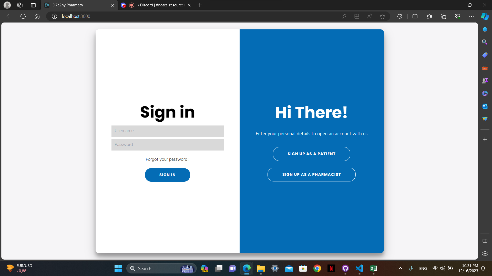
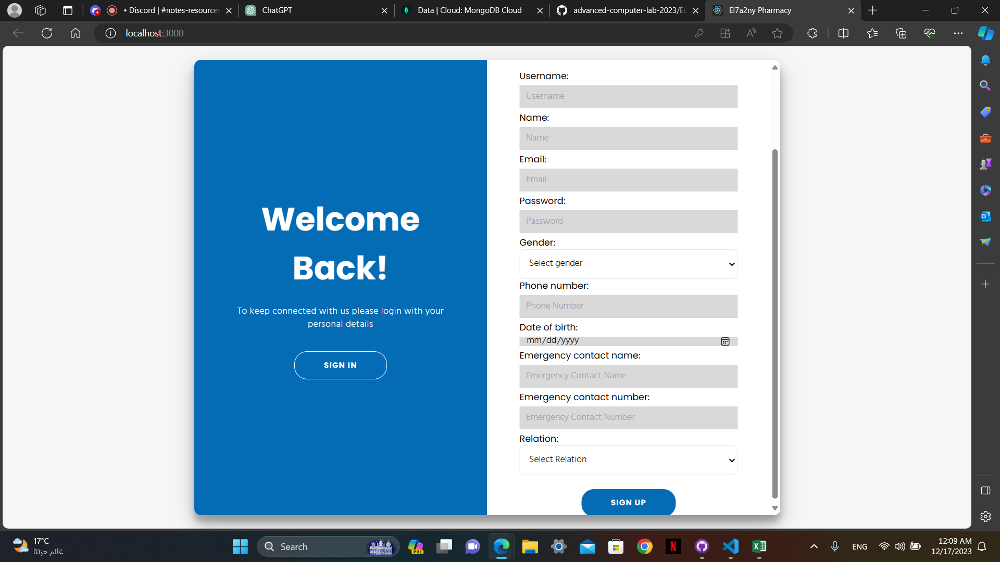
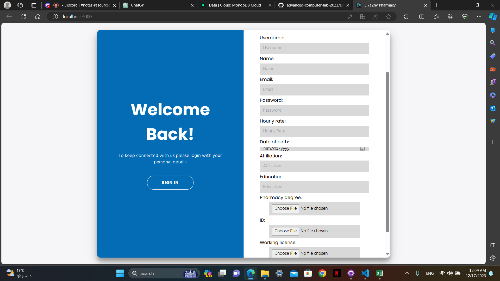
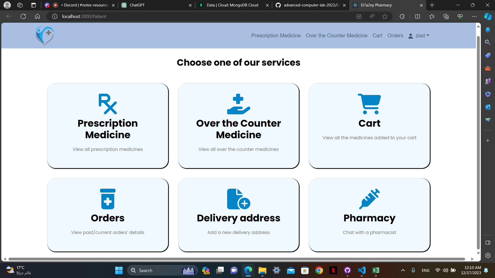
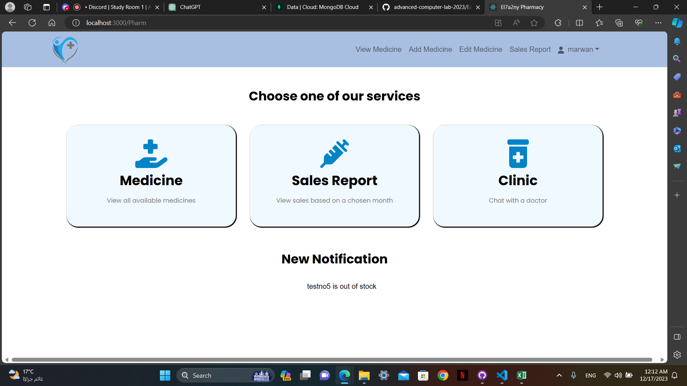
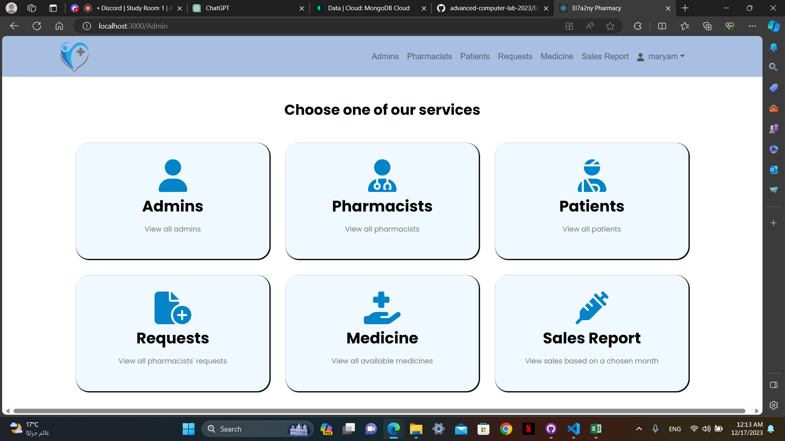

## Tech/Framework Used

This project is developed using the MERN stack, a popular technology stack for building full-stack web applications. The MERN stack includes:

- **MongoDB:** NoSQL database for storing and retrieving data.
- **Express.js:** A web application framework for building our API and handling HTTP requests.
- **React:** A JavaScript library for building UI.
- **Node.js:** A runtime environment for executing JavaScript code on the server.

### Additional Tools and Libraries


## Features

### Patient-Friendly Appointments

- **Cancel Orders:** Patients have the flexibility to cancel orders at any time. In case of cancellation, the money is automatically returned to the patient's wallet.

### Secure Payment Options

- **Credit Card Payments:** Seamless and secure credit card payments for medicines are supported, ensuring a hassle-free transaction experience for patients.

- **Wallet Integration:** Patients have the option to pay for medicine using their wallet balance, providing a convenient and quick payment method.

## How to use

- backend:

```bash
  cd backend/src
  node app
```

- frontend:

```bash
  cd frontend
  npm start
```

## Code Examples

**the following shows how based on what type user is entering what routes is open for them**

```jsx
// user hasn't logged in yet or is a pending pharmacist so won't access anything except login, reset password, and register pages.
if(sessionStorage.getItem("type") === null || sessionStorage.getItem("type") === "PendingPharmacist") {
root.render(
  <React.StrictMode>
    <BrowserRouter>
      <Routes>
        <Route path="/" element={<App />} />
        <Route path="/LoginAll" element={<LoginAll />} />
        <Route path="/Login" element={<Login />} />
        <Route path="/LoginPage" element={<LoginPage />} />
        <Route path="/AddPharmacist" element={<AddPharmacist />} />
        <Route path="/AddPatient" element={<AddPatient />} />
        <Route path="/ResetPass" element={<ResetPass />} />
      </Routes>
    </BrowserRouter>
  </React.StrictMode>
);
// if he is an admin a set of routes is only available for him meaning he can't access pharmacists' or patients' routes even if he know the url
} else if(sessionStorage.getItem("type") === "Admin") {
root.render(
  <React.StrictMode>
    <BrowserRouter>
      <Routes>
        <Route path="/Admin" element={<Admin />} />
        <Route path="/AddAdmin" element={<AddAdmin />} />
        <Route path="/AddEmail" element={<AddEmail />} />
        <Route path="/ViewAdminInfoAdmin" element={<ViewAdminInfoAdmin />} />
        <Route path="/ViewPharmInfoAdmin" element={<ViewPharmInfoAdmin />} />
        <Route path="/ViewPatientInfoAdmin" element={<ViewPatientInfoAdmin />} />
        <Route path="/ViewRequestsAdmin" element={<ViewRequestsAdmin />} />
        <Route path="/ViewMedAdmin" element={<ViewMedAdmin />} />
        <Route path="/changePassword" element={<ChangePassword />} />
        <Route path="/ViewSalesAdmin" element={<ViewSalesAdmin />} />
      </Routes>
    </BrowserRouter>
  </React.StrictMode>
);
// if he is a pharmacist a set of routes is only available for him meaning he can't access patients' or admins' routes even if he know the url
} else if(sessionStorage.getItem("type") === "Pharmacist") {
root.render(
  <React.StrictMode>
    <BrowserRouter>
      <Routes>
        <Route path="/Pharm" element={<Pharm />} />
        <Route path="/AddMedicine" element={<AddMedicine />} />
        <Route path="/EditMedicine" element={<EditMedicine />} />
        <Route path="/ViewMedPharm" element={<ViewMedPharmCopy />} />
        <Route path="/changePassword" element={<ChangePassword />} />
        <Route path="/ViewSales" element={<ViewSales />} />
        <Route path="/ChatAppP" element={<ChatAppP />} />
        <Route path="/ChatAppD" element={<ChatAppD />} />
      </Routes>
    </BrowserRouter>
  </React.StrictMode>
);
// if he is a patient a set of routes is only available for him meaning he can't access pharmacists' or admins' routes even if he know the url
} if(sessionStorage.getItem("type") === "Patient") {
root.render(
  <React.StrictMode>
    <BrowserRouter>
      <Routes>
        <Route path="/Patient" element={<Patient />} />
        <Route path="/ViewMedPatient" element={<ViewMedPatient />} />
        <Route path="/ViewMedPrescriptions" element={<ViewMedPrescription />} />
        <Route path="/Alternatives" element={<Alternatives />} />
        <Route path="/Cart" element={<Cart />} />
        <Route path="/ViewOrders" element={<ViewOrders />} />
        <Route path="/Address" element={<AddDeliveryAddress />} />
        <Route path="/PaymentSuccess" element={<PaymentSuccess />} />
        <Route path="/PaymentCanceled" element={<PaymentCanceled />} Component={PaymentCanceled} />
        <Route path="/PaymentCashSuccess" element={<PaymentCashSuccess />} />
        <Route path="/changePassword" element={<ChangePassword />} />
        <Route path="/ChatApp" element={<ChatApp />} />
      </Routes>
    </BrowserRouter>
  </React.StrictMode>
);
}
```

**the following code shows how we check which user is logging in**

```jsx
const signin = async (req, res) => {
    const username = req.body.Username;
    const password = req.body.Password;
    let user = await Patient.findOne({ Username: username });
    let isValid;
    if (user) {
        isValid = await comparePassword(password, user.Password);
        if (isValid) {
            res.status(200).send({
                token: createJWTP(username),
                type: "Patient",
                Username: username,
            });
        } else {
            res.status(401).send("Invalid password");
        }
    } else {
        user = await Pharmacist.findOne({ Username: username });
        if (user) {
            isValid = await comparePassword(password, user.Password);
            if (isValid) {
                if (user.ReqStatus == "Accepted") {
                    res.status(200).send({
                        token: createJWTPH(username),
                        type: "Pharmacist",
                        Username: username,
                    });
                } else {
                    res.status(200).send({
                        type: "PendingPharmacist",
                        Username: username,
                    });
                }
            } else {
                res.status(401).send("Invalid password");
            }
        } else {
            user = await Admin.findOne({ Username: username });
            if (user) {
                isValid = await comparePassword(password, user.Password);
                if (isValid) {
                    res.status(200).send({
                        token: createJWTA(username),
                        type: "Admin",
                        Username: username,
                    });
                } else {
                    res.status(401).send("Invalid password");
                }
            } else {
                res.status(401).send("User not found");
            }
        }
    }
};
```

## API References

[API-References](API.md)

## Tests using postman

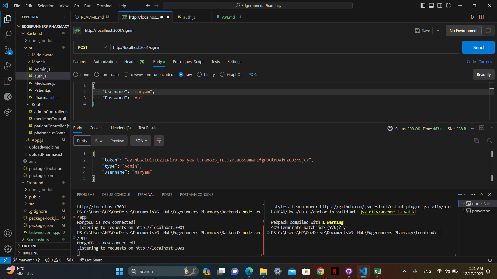
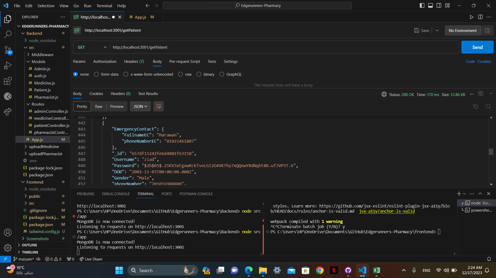
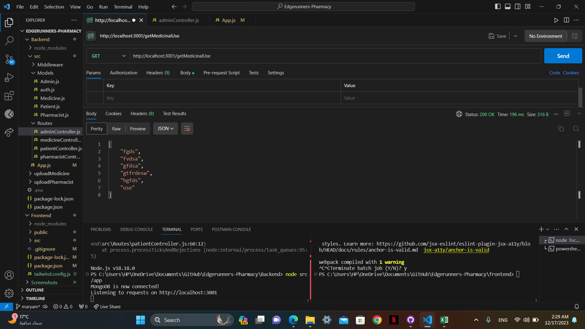
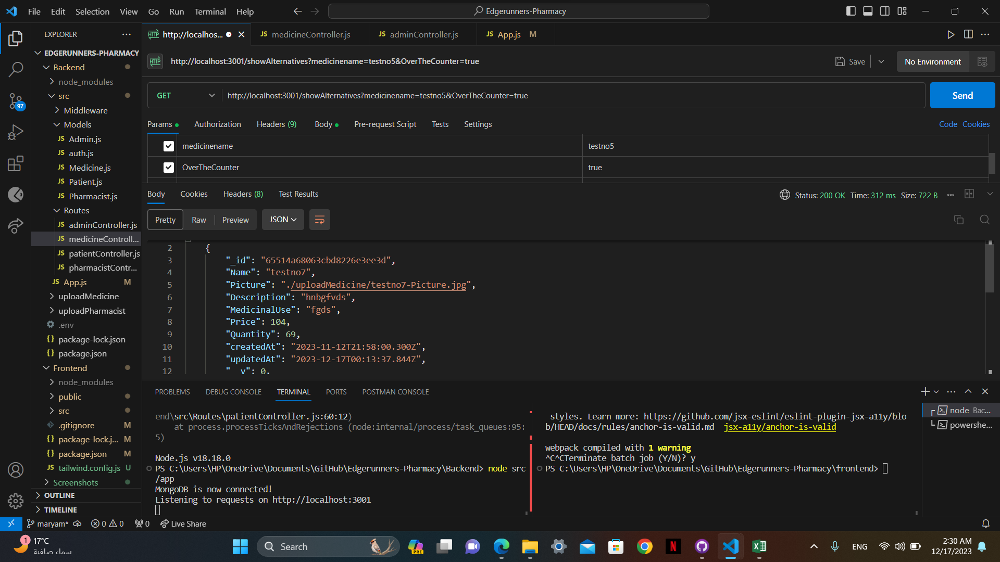
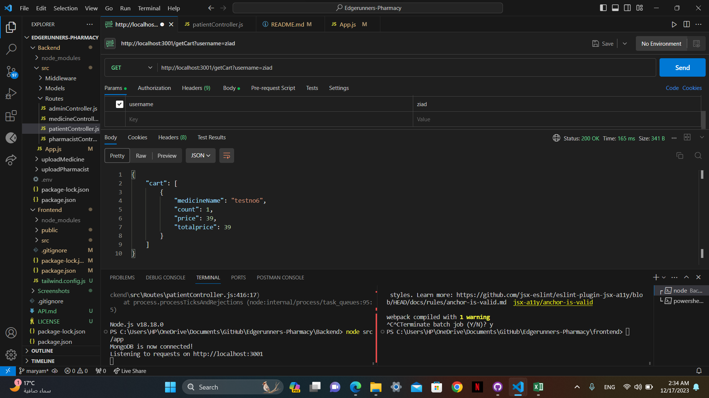

## Contribution

if you would like to contribute there are alot of things to optimize in both backend and frontend.

**backend:**

- optimizing code's efficiency & performance.
- adding more validations for the data that comes from the client side.
- adding more middleware to increase the security of the api server.

**frontend:**

- create better looking UI in Pages.
- add animations to make it look more interactive.
- make website compatible with other devices with different screen sizes.

## Credits

- [how to create api backend nodejs with scott moss](https://frontendmasters.com/courses/api-design-nodejs-v4/)
- [Intro to react with Brian Holt](https://frontendmasters.com/courses/complete-react-v8/)
- [Carousel](https://getbootstrap.com/docs/4.0/components/carousel/)

## License

[MIT license](LICENSE)